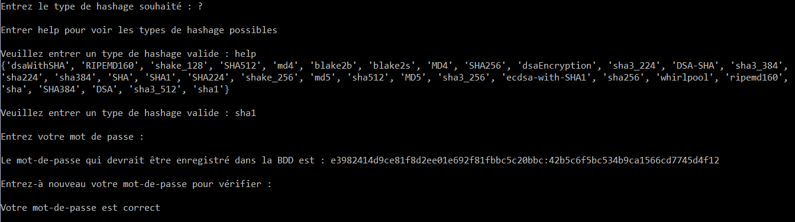

.. _hashlib-tutorial:

===========
``hashlib``
===========

Par Pedro Costa [#pc]_

Introduction
------------
:py:mod:`hashlib` est un module propre à Python implémenttant une interface commune à
plusieurs algorithmes de hachage sécurisés et de synthèse de messsages.
Ce module comprend les algorithmes suivants :
``SHA1``, ``SHA224``, ``SHA256``, ``SHA384``, and ``SHA512``
(défini dans `FIPS 180-2`_) tout comme l'algorithme ``MD5`` mais qui lui
est déprécié. Le terme synthèse de messages est l'ancêtre de hachage sécurisé.

Attention à ne pas confondre le hachage_ qui fourni une empreinte à une donnée
avec le cryptage_ qui transforme une donnée en une autre incompréhensible.

Pour chaque type de hachage il y a un constructeur correspondant, ces derniers
retournent tous un objet ``hash``. Par exemple un objet SHA1 pour le construceur
sha1().

Afin d'utiliser le module :py:mod:`hashlib` il n'y a rien de plus simple que de
l'importer dans votre fichier python.

:py:mod:`hashlib` ne contient pas uniquement les algorithmes cités précédemment, il y a
également :py:func:`hashlib.blake2b` et :py:func:`hashlib.blake2s` qui sont des
hachages plus efficaces et simple que les précédents.
(Voir BLAKE2_ pour plus de précisions)

D'autres algorithmes peuvent également être disponibles en fonction de la
bibliothèque OpenSSL que python utilise sur votre plateforme. Sur la plupart,
des plateformes les constructeurs SHA3 (Keccak) et SHAKE sont disponibles.
Ceci depuis la version 3.6 de Python.

Fonctions
---------
Les fonctions de ce module répondent à une grande partie de nos besoins
concernant le hachage de données. Parmis ces fonctions voici les plus
importantes :

- :py:func:`hashlib.new` constructeur de l'objet ``hash``
- :py:data:`hashlib.algorithms_available` liste des algorithmes accessibles
- :py:meth:`hashlib.hash.update` met à jour l'objet ``hash`` avec l'argument sous forme
  de bytes. Va donc haché la valeur de l'argument.
- :py:meth:`hashlib.hash.digest` retourne les données hachées passées à la méthode update
- :py:meth:`hashlib.hash.hexdigest` pareil que digest mais le résultat est en hexadécimale

À l'aide de SHAKE_ (Keccak) vous pouvez passer en argument des fonctions ``digest()``
la taille souhaitée qu'aura votre résultat.

Exemple :

.. code-block:: pycon

    >>> import hashlib

    >>> shake = hashlib.shake_128()

    >>> shake.update(b"Nobody expects the spanish inquisition")

    >>> shake.digest(12)
    b'\xe4\x93\xff%\x84\x8d\xf2\xcd!\x1e\x90\x15'

    >>> shake.digest(64)
    b'\xe4\x93\xff%\x84\x8d\xf2\xcd!\x1e\x90\x15\x1cAw\xd0f\xaf[\xa6\
    xd4nkJm\x086\xf5@\x8ac\xe5\x04\x9f|Q\xca\xa6\xc1\xf6\x15{C\xda\
    xea1A\x16\x15B\x0fB(`a\x12\xb7l/\xbe6\xef\xdc\xb0'

Exemple
--------
Rien de mieux pour mettre en pratique une librairie de hachage que de faire
un système très basique de hachage de mot-de-passe. Dès qu'il nous faut stocker
une donnée sensible dans une base de données, il faut la hacher. Pour cela,
l'algorithme ``md5()`` était utilisé à l'époque. Cependant il a rapidement été
cassé et du coup est maintenant déprécié.

Nous utilisons actuellement sha1 et ses paires, malgré le fait qu'il a à son tour
été aussi cassé. C'est pour cela qu'il est conseillé d'utiliser dorénavant
Blake 2 ou pbkdf2_hmac afin de hacher un mot-de-passe (voir chapitre suivant).

Un exemple utilisant la palette d'algorithme de hachage a été fait. Son
fonctionnement est le suivant :

- L'utilisateur choisi son type de hachage
- Si il ne sait pas lequel entrer, il peut taper la commande help et les
  types de hachage possibles lui seront affichés.
- Une fois un type correct entré, l'utilisateur peut saisir son mot-de-passe.
- La version hachée de ce dernier sera affichée ainsi qu'un salt permettant un
  meilleur hachage.
- Finalement, l'utilisateur peut saisir à nouveau son mot-de-passe pour
  vérifier s'il est le bon en fonction du mot-de-passe haché.

Résultat de l'exemple avec comme mot-de-passe "Salut" :

Les parties importantes dans le code sont les fonctions de hachage du mot-de-passe
et la fonction de vérification. Voici leur code respectif.

.. literalinclude:: ./examples/exemple.py
  :linenos:
  :lines: 11,26-30

La 2ème ligne permet d'initialiser un salt à un nombre aléatoire hexadécimale.
``uuid4()`` génère un objet UUID aléatoire, ce qui fait que ce n'est au final pas
réellement alétoire.

Le contenu qui sera haché doit être encodé correctement sous forme binaire pour
qu'il puisse être passé à la fonction update vue précédemment.

Le contenu haché est finalement renvoyé avec le salt qui permettra d'en suite tester
la validité de la donnée dans l'autre fonction.

.. literalinclude:: ./examples/exemple.py
  :linenos:
  :lines: 33,48-52

Dés la 2ème ligne on sépare le mot-de-passe haché du salt. On pense bien à
réencoder comme il faut le contenu.

On fait en suite une comparaison entre le mot-de-passe haché et le mot-de-passe
entré à nouveau qui est haché de la même façon afin de vérifier la validité de
ce dernier. On utilise ici une fonction de comparaison de hmac permettant
d'assurer parfaitement la comparaison. Voir l'explication de ce choix dans
l'article "Secrets" de Monsieur Pedretti.

Comme dit précédemment, cet exemple est caduque avec les type de hachage shaXXX
et md5. C'est pour cela qu'un deuxième exemple est nécessaire avec Blake 2.

Blake 2
-------
Avant de parler de Blake2, nous faisons une rapide paranthèse sur un type de
hachage particulièrement puissant concernant les mots-de-passe. Nous parlons ici
de la fonction :py:func:`hashlib.pbkdf2_hmac`, cette dernière permet de fortement
hacher un mot-de-passe. Cette fonction utilise une fonction pseudo-random de hmac.
Le fonctionnement de ce hachage est basé sur l'utilisation d'un type de hachage
vu précédemment, un salt ainsi qu'un nombre d'itérations correspondant au
type du hachage choisi (nous observons que cela diminue fortement la vitesse de
ce hachage). Voici un exemple simple venant de la documentation de :py:mod:`hashlib`
(hexlify encode la valeur binaire en héxadécimale).

.. code-block:: pycon

    >>> import hashlib, binascii
    >>> dk = hashlib.pbkdf2_hmac('sha256', b'password', b'salt', 100000)
    >>> binascii.hexlify(dk)
    b'0394a2ede332c9a13eb82e9b24631604c31df978b4e2f0fbd2c549944f9d79a5'

Maintenant que la parenthèse est fermée, nous pouvons aborder le sujet de Blake 2.
Ce dernier permet de résoudre un bon éventail de problèmes concernant l'adressage
d'empreintes aux données. De plus c'est le type de hachage le plus rapide parmis
ces prédécesseurs.

En outre, Blake 2 permet de configurer la taille de digest permettant des outputs
différents pour une même donnée, il peut haché des clés d'authentifications mais
aussi est capable de signer des cookies. Ce type de hachage est bien pratique
pour le hachage aléatoire en utilisant le paramètre salt qui permettra donc
d'obtenir des signatures différentes pour une même donnée.

Finalement, il peut mettre en place une personnalisation de son hachage,
cette démarche est fortement conseillée car il a été remarqué que la signature de
données connexes facilite l'attaque et le forçage de ces dernières. C'est pour cela,
que nous pouvons utiliser le paramètre person qui va lui aussi donner des
signatures distinctes pour une seule et même donnée. L'avantage d'utiliser ce
paramètre est que nous pouvons utiliser une même taille de digest ou une même clé !!

Un exemple pertinant serait celui des cookies, car c'est une obligation pour
tout développeur web de signer ce type de données sensible.

Ce dernier ressemble beaucoup à son précédent, nous voulons ici spécialement
montrer la force de blake2 qui permet une personnalisation poussée de notre hachage.

.. literalinclude:: ./examples/exemple_blake2.py
  :linenos:
  :lines: 14-18

Précisément cette fonction, où nous voyons bien la personnalisation lors de
l'inisalisation. Cette dernière se fait précisément en fonction de la personne
s'étant identifiée, de cette manière, en même temps que nous hachons le cookie,
on pourra vérifier l'authenticité de l'utilisateur.

Conclusion
----------
Hashlib permet une utilisation plutôt complête concernant la signature de données.
Toutes les fonctions de ce module n'ont pas été traitée ici, mais les fonctions
les plus importantes ont étées expliquées et mise en pratique avec deux exemples.

Le hachage de données est quelque chose de nécessaire au sein de l'informatique,
la sécurité est certainement le point le plus sensible lors de la création
d'applications. Le concepteur doit penser aux attaques possibles de personnes
malveillantes et le hachage résout une légère partie de la question.

Il ne suffit pas d'implémenter sans réfléchir du hachage avec ce module mais bien
savoir comment manipuler ces fonctions et en faire quelque chose de solide afin
de se protéger d'attaques extérieures.

Cependant, utilisé uniquement hashlib risque de ne pas suffire à la bonne sécurité
d'une application. Rien que dans mes exemples j'ai eu besoin d'utiliser la fonction
`compare_digest()` afin de comparer deux signatures. Car le "==" n'est simplement
pas suffisant et assez solide à cause des temps de comparaisons.
Le meilleur moyen est donc de coupler ces modules tel que `hmac` ou autres afin
d'avoir une application viable et stable. 

.. [#pc] <pedro.costa@he-arc.ch>

.. Bibliographie

.. _FIPS 180-2: http://csrc.nist.gov/publications/fips/fips180-2/fips180-2.pdf
.. _hachage: https://fr.wikipedia.org/wiki/Fonction_de_hashage
.. _cryptage: https://fr.wikipedia.org/wiki/Chiffrement
.. _BLAKE2: https://blake2.net/blake2_20130129.pdf
.. _SHAKE: https://docs.python.org/3/library/hachlib.html#shake-variable-length-digests
