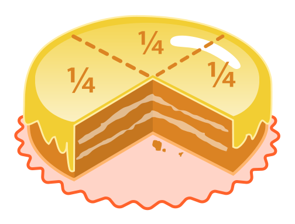

.. _math-tutorial:

========================
``math`` / ``fractions``
========================

Par Gabriel Griesser [#gg]_

Introduction
------------

Le principe du module :py:mod:`math` est d'effectuer diverses opérations mathématiques avec Python.
Dans ce chapitre, nous verrons les principales opérations possibles en utilisant le module :py:mod:`math` et les fractions en Python en utilisant ce module.

Les nombres entiers sont relativement simple a utiliser en Python.
Ce langage devine facilement si un nombre est entier ou pas grâce à la virgule (ou point décimal dans *Python*).
Si le nombre ne possède pas de virgule, Python le reconnait comme un nombre entier.

Pour effectuer des calculs exacts avec des fractions, on importe le module :py:mod:`fractions`
afin de transformer Python en un langage de programmation spécialisé dans les fractions.

Nombres
-------

Avant tout, il faut savoir que les nombres sont déclarés comme des variables en Python, et que le type de ces dernières
sont reconnu à l'initialisation de la variable.
Python comporte cinq catégories de nombres :

 * :py:class:`int` pour les nombres entiers,
 * :py:mod:`fractions` pour les fractions (quotients d'entiers par des entiers),
 * :py:mod:`decimal` et :py:class:`float` pour les réels (ou *nombres décimaux*),
 * :py:class:`complex` pour les nombres complexes.

---------
Exemples
---------
Voici un exemple tout simple pour commencer.

.. code-block:: pycon

    >>> a = 3
    >>> type(a)
    <class 'int'>
    >>> b = 3.14
    >>> type(b)
    <class 'float'>
    >>> int(b)
    3

On remarquera que Python reconnait *a* comme un entier,  *b* comme un nombre décimal,
et *c* qui peut être entier même s'il est obtenu à partir de *b*.
*c* sera converti en entier grâce à *int()* qui s'occupera de faire la conversion d'un nombre décimal en un entier.
Ici, *c* vaut 3.

En Python, la priorité des opérations s'effectue comme en algère. On effectue dans l'ordre

#. Les parenthèses
#. Les fonctions (racines, puissances)
#. Les multiplications et divisions
#. Les additions et soustractions.

Outre les additions, soustractions et multiplication ``print (a+b), print(a-b), print(a*b)``,
la division se présente sous deux formes : `Le quotient euclidien` qui est un entier, et le `quotient exact`
qui est une fraction, donc un réel pour Python.
Pour choisir quelle forme utiliser, il suffit de dédoubler le *slash* de la division.
Ici, le premier *print* affichera ``1.5`` alors que le dédoublement du *slash* changera la réponse en ``1``.
Cette méthode est disponible que depuis *Python 3*, en *Python 2.X*, il était nécessaire d'écrire
``float(a/b)`` afin d'avoir la valeur en réel.

.. code-block:: pycon

    >>> a = 3
    >>> b = 2
    >>> a / b
    1.5
    >>> a // b
    1

---------------------
Fonctions de nombres
---------------------

La fonction :py:func:`ceil(x) <math.ceil>` (x est donné en float) retourne la plus petite valeur entière, supérieure ou égale à x.

.. code-block:: pycon

	>>> from math import ceil
	>>> ceil(10)
	10
	>>> ceil(10.1)
	11
	>>> ceil(0.00000001)
	1
	
La fonction :py:func:`fabs(x) <math.fabs>` retourne la valeur absolue de *x*.

.. code-block:: pycon

    >>> from math import fabs
    >>> fabs(-10)
    10.0

La fonction :py:func:`factorial(x) <math.factorial>` retourne *x* factoriel. Si *x* n'est pas un int ou est négatif, la fonction retourne
une erreur de type *ValueError*.

.. code-block:: pycon

    >>> from math import factorial
    >>> factorial(4)
    24

La fonction :py:func:`gcd(a, b) <math.gcd>` retourne la plus grand diviseur commun des int *a* et *b*.

.. code-block:: pycon

    >>> from math import gcd
    >>> gcd(24, 6)
    6

La fonction :py:func:`isfinite(x) <math.isfinite>` retourne ``True`` si *x* n'est ni un nombre infini, ni un NaN (*not a number*).
Renvoie ``False`` sinon.
Pour calculer :math:`\frac{1}{0}`, nous utilisons la librairie :py:mod:`decimal`. Grâce à cette dernière, nous pouvons définir un environnement pour
les calculs arithmétiques. En faisant cela, la division :math:`\frac{1}{0}` ne lèvera pas d'exception et pourra être testé avec ``isfinite()``.

.. code-block:: pycon

    >>> from math import isfinite, inf
	>>> from decimal import setcontext, ExtendedContext, Decimal 
    >>> isfinite(2)
    True
    >>> isfinite(0.0)
    True
    >>> isfinite(0/1)
    True
    >>> setcontext(ExtendedContext)
    >>> isfinite(Decimal('1')/Decimal('0'))
    False

---------------------------------------
Fonctions logarithmiques et puissances
---------------------------------------

On peut également utiliser diverses fonctions du module :py:mod:`math` comme les `racines` ou les `puissances`.
Ici, *a* est la racine carrée de 100, la commande ``a.is_integer()``
renvoi ``True`` si le nombre est un *int*, ``False`` sinon.
*b* est la puissance cubique de *a*, c'est à dire 1'000.
Les puissances peuvent aussi s'écrire en dédoublant l'astérisque de la multiplication.
Les racines comme les puissances peuvent êtres obtenues en dédoublant l'astérisque avec *0.5*
Dans cet exemple, comme aucune des variables ne possède de virgule, Python les reconnait comme des *int*.

.. code-block:: pycon

    >>> 100**0.5
    10.0
    >>> 10**3
    1000.0

La fonction :py:func:`log(x, [base]) <math.log>` retourne le logarithme naturel de *x* (en base *e*).
Avec deux arguments, cette fonction retourne le logerithme de *x* dans la base donnée.
Il est possible d'utiliser les fonction :py:func:`log2(x) <math.log2>` ou :py:func:`log10(x) <math.log10>` pour retourner le logarithme en base 2 ou 10.

.. code-block:: pycon

    >>> from math import log, log2, log10
    >>> log(4)
    1.386294361119
    >>> log(4, 2)
    2.0
    >>> log2(8)
    3.0
    >>> log10(100)
    2.0

-------------------------------------------
Angles, fonctions trigonométriques et *PI*
-------------------------------------------

La conversions d'angle est également une propriété de notre module :
:py:func:`math.degrees` et :py:func:`math.radians` permettent la conversion de l'angle *x* en degré ou en radians selon la fonction.

.. code-block:: pycon

    >>> from math import radians, degrees
    >>> x=radians(180)
    >>> print(x)
    3.141592653589793
    >>> y=degrees(x)
    >>> print(y)
    180.0

Qui dit conversion d'angle dit aussi fonctions trigonométriques.
Ces dernières, :py:func:`sin(x) <math.sin>`, :py:func:`cos(x) <math.cos>` et :py:func:`tan(x) <math.tan>`, font également parties du module *math*.
Elles s'expriment toutes sous la forme ``sin(x)``, ``cos(x)``, ``tan(x)`` et renvoient le sinus, cosinus et tangente de *x* en radians.

Les fonctions hyperboliques sont aussi présentes en rajoutant la lettre ``h`` à la suite des fonctions trigonométriques.
À noter que la différence du type d'angle (degré ou radian) se montre très nettement au dernier *print*.

.. attention:: les fonctions hyperboliques ne travaillent pas sur un cercle (donc un angle), mais une hyperbole. Des exemples avec des degrés et des radians n'ont donc aucun sens.

.. code-block:: pycon

    >>> from math import degrees, radians, sin, cos, tan, tanh, cosh, sinh
    >>> x=radians(180)
    >>> y=degrees(x)
    >>> sin(y)
    -0.8011526357338304
    >>> cos(y)
    -0.5984600690578581
    >>> tan(y)
    1.3386902103511544
    >>> tanh(x)
    0.99627207622075
    >>> cosh(x)
    11.591953275521519
    >>> sinh(y)
    7.446921003909191e+77

Les fonctions :py:func:`asin(x) <math.asin>`, :py:func:`acos(x) <math.acos>`, :py:func:`atan(x) <math.atan>`, qui correspondent aux *arc sin, arc cos*, et *arc tan* peuvent être utilisées.
Attention cependant aux limites, *x* doit être compris entre -1 et 1.

.. code-block:: pycon

    >>> from math import acos, asin, atan

    >>> acos(1)
    0.0

    >>> acos(1.9)
    Traceback (most recent call last):
      File "<stdin>", line 1, in <module>
    ValueError: math domain error

    >>> asin(0.5)
    0.5235987755982989

    >>> atan(0.333333)
    0.3217502543966122

Le nombre *pi* fait également partie de notre module, comme bien d'autres constantes (*e*, *tau*, etc.).
Pour l'utiliser, il suffit simplement d'écrire ``pi`` en commande. Cela va de même pour les autres constantes.
La fonction :py:func:`isclose(a, b) <math.isclose>` Nous permet de comparer deux nombres en retournant *True* si ces derniers sont relativement proches l'un de l'autre.

.. code-block:: pycon

    >>> from math import pi, cos, tan, isclose
    >>> pi
	3.141592653589793
    >>> cos(pi)
    -1.0
    >>> tan(pi/4)
    0.9999999999999999
    >>> tan(pi/4) == 1
    False
    >>> isclose(tan(pi/4), 1)
    True
	
Fractions
---------

L'écriture de nombres non entiers sous forme de fractions est un concept fondamental des mathématiques.
Chaque fois que le dénominateur n'est pas une puissance de  10, on utilise une écriture fractionnaire.
Par exemple : Si l'on souhaite afficher ``9 heures 17``, cela correspond à ``9 + 17/60 = 493/60``;
Encore ici, lorsque qu'on exprime une attente sous forme de quart d'heure, cela correspond à une fraction.
Par exemple : J'ai attendu trois quarts-d'heure, je peux l'écrite aussi ``J'ai attendu 3/4 d'heure``;

Vous l'avez compris, l'utilisation des fractions se fait quotidiennement. Pour exprimer une telle forme
en *Python*, il faut importer le module :py:mod:`fractions`

--------
Exemple
--------

Voici quelques exemples simples mais efficaces de l'utilisation de ce module.
Pour rentrer la fraction n/d dans *Python*, on utilise le module *fractions*.
Si on rentre 0 comme dénominateur, la fraction ne se crée pas et on a un message d'erreur :
Comme une fraction est un quotient, on ne peut pas diviser par 0.

.. code-block:: pycon

    >>> from fractions import Fraction
    >>> Fraction(24, 10)
    12/5

Une fois la fraction calculée, on peut afficher son numérateur et son dénominateur avec ``a.numerator`` et ``a.denominator``.
Bien entendu, le numérateur de ``24/10`` n'est pas 24, ce dernier est réduit. On obtiendra donc 12.

.. code-block:: pycon

    >>> a = Fraction(24, 10)
    >>> a.numerator
    12
    >>> a.denominator
    5

Pour obtenir le résultat de la fraction en nombre réel, il faut transformer la fraction en nombre flottant, :py:class:`float`.

.. code-block:: pycon

    >>> float(Fraction(24,10))
    2.4

-----------
Opérations
-----------

Les opérations sur les fractions se notent comme avec des nombres, mais le résultat sortant est en général une fraction.
Les opérations unaires (de bases) se font comme si l'on manipulait des nombres. *Python* les reconnaîtra néanmoins comme
des fractions.

Le quotient de deux fractions est également une fraction, pour autant que la 2ème fractions ne soit pas nulle :
Il est également possible d'afficher le reste euclidien avec le modulo. Ce reste est une fraction.

.. code-block:: pycon

    >>> a = Fraction(23, 42)
    >>> b = Fraction(34, 13)
    >>> a / b
    299/1428

    >>> a % b
    23/42

L'exposant d'une fraction est une fraction, pour autant que l'exposant est un entier :

.. code-block:: pycon

    >>> Fraction(23, 42) ** 3
    12167/74088

    >>> Fraction(23, 42) ** -3
    74088/12167

Si l'exposant est un réel, le résultat sera un réel :

.. code-block:: pycon

    >>> Fraction(23, 42) ** 0.6
    0.6967662840791479

L'opposé d'une fraction s'obtient en la faisant précéder du signe - :

.. code-block:: pycon

    >>> -Fraction(23, 42)
    -23/42

L'inverse d'une fraction s'obtient en la divisant par 1 :

.. code-block:: pycon

    >>> 1 / Fraction(23, 42)
    42/23

----------------------
Fractions égyptiennes
----------------------

Une `fraction égyptienne <http://fr.wikipedia.org/wiki/Fraction_%C3%A9gyptienne>`_ est une somme de fractions unitaires.
C'est-à-dire de fractions qui ont des numérateurs égaux à un et des dénominateurs entiers positifs,
avec ces dénominateurs tous différents.
De ce fait, **toute fraction peut s'écrire comme une somme de fractions égyptiennes**.
Dans l'exemple ci-dessous, l'algorithme fournit une liste de fractions, toutes de numérateur 1, dont la somme
est une fraction donnée *f*.

.. literalinclude:: ./examples/Egyptien.py

Dans cet exemple, le dénominateur d'une fraction égyptienne est choisi (en entier) et est plus grand
que l'inverse de la fraction *f* (pour que l'algorithme converge). Attention si l'inverse de *f* est entier,
on ne doit pas ajouter 1 car la suite serait infinie. On utilise alors la fonctoin ``ceil`` (qui veut dire plafonner, voir plus haut dans le doucment).

 - Il faut importer le module *math* qui contient la fonction ceil.
 - L'objet ``ceil(1/f)`` n'est plus un entier mais un réel (par conséquent, il ne peut plus être le dénominateur d'une fraction, donc erreur de *Python*). 
 - On convertit alors ce réel en entier (avec le *int*).

Comme *Python* ne possède pas de boucle *do..while*, il faut ajouter la dernière fraction égyptienne à la liste, 
pour que celle-ci soit complète.

Le résultat, pour :math:`\frac{21}{13}` est : :math:`1 + \frac{1}{2} + \frac{1}{9} + \frac{1}{234}`

Cela signifie que la somme de ces fractions vaut :math:`\frac{21}{13}`

Conclusion
----------

Le calcul mathématique est facile à réaliser en *Python*.
Il est aisé de demander à *Python* de nous indiquer le type d'une variable. 
La librairie :py:mod:`math` propose un vaste choix de fonctions. Celles montrées dans ce chapitres sont les plus courantes,
il en existent encore bien d'autres.
*Python* reconnaît et manipule également les nombres complexes. Il suffit de rentrer ``complex()`` afin
d'utiliser ces derniers. Bien entendu, toutes les manipulations propres aux nombres complexes
(réel, imaginaire, module, argument) sont possibles.
En important le module :py:mod:`fractions` , il est facile d'effectuer nos manipulations en utilisant des
fractions. Les opérations sur les fractions se font comme pour les nombres, au moment de l'impression.

.. [#gg] <gabriel.griesser@he-arc.ch>

.. - Nombres : <https://fr.wikibooks.org/wiki/Math%C3%A9matiques_avec_Python_et_Ruby/Nombres_en_Python>`
.. - Nombres opérations : <https://fr.wikibooks.org/wiki/Math%C3%A9matiques_avec_Python_et_Ruby/Nombres_entiers_en_Python>`
.. - Fractions : <https://fr.wikibooks.org/wiki/Math%C3%A9matiques_avec_Python_et_Ruby/Fractions_en_Python>`