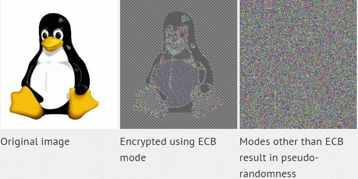

.. _pycrypto-tutorial:

============
``Pycrypto``
============

Par Luca Srdjenovic INF2dlm-a [1]_

Introduction
------------

``Pycrypto`` est une bibliothèque qui fournit  des outils de cryptographie primitive
implémententés en language Python.  Par exemple quand on fait du réseau, on a souvent
besoin d'utiliser la cryptographie. En effet des méchants peuvent se situer entres deux machines
qui commmuniquent pour les écouter. Et le méchant s'il le désire peut faire encore pire,
c'est-à-dire remplacer un bout ou totalement une partie du message envoyé. A noter que pour
des raisons de sécurité, il est recommandé d'utiliser une bibliothèque de haut niveau
ce qui donnera moins de travail au programmeur pour éviter des longues analyses de sécurité.
Pycrypto correspond bien à cette demande mais est une approche dangereuse qui demande de
porter un grand détail à son fonctionnement. Cependant il permet de faire ce que l'on désire en
cryptographie.

Mots clefs
----------

Quelques mots clefs pour aider la compréhension pour la suite :
  - `plaintext`: message original
  - `ciphertext`: message après la transformation cryptograhpique appliqué au
                  message orignal
  - `encrypt`: produit le ciphertext en appliquant la transformation
               cryptograhpique au plaintext
  - `decrypt`: produit le plaintext en appliquant la transformation
               cryptograhpique au ciphertext
  - `cipher`: une composition particulière de la transformation
              cryptograhpique fournissant encryptage et décryptage
  - `hash`: transformation cryptographique qui prend une grande entrée
            et la transforme en une unique sortie (de taille fixée).

Type de cryptage
----------------

En cryptographie, il existe deux types de chiffrement.
Le symmétrique et l'asymmétrique. Comme PyCrypto est vaste, nous allons juste
nous intéresser au chiffrement symétrique.

Pour le symmétrique, il y a deux types de clef :
  - ``stream ciphers``: opération sur des flux de données un byte à la fois
  - ``block ciphers``: opération de blocks sur des données, en 16 bytes
    à la fois.

Nous allons utiliser le block cipher. Le plus commun et standard avancé est l'AES
(https://secure.wikimedia.org/wikipedia/en/wiki/Advanced_Encryption_Standard) si
on n'a pas trop d'idée de quel algorithme de cryptage à utiliser.
Un peu moins commun est le DES.c'est le standard de la cryptographie car il
était très utilisé dans le passé mais sa clef est trop petitE aujourd'hui à cause
de ces 56-bit de taille.

Voici une liste des différents alogorithmes possibles :

   +-----------------------+-----------------------+
   | Nom du module         | Type                  |
   +=======================+=======================+
   | Crypto.Cipher.AES     | Block                 |
   +-----------------------+-----------------------+
   | Crypto.Cipher.ARC2    | Block                 |
   +-----------------------+-----------------------+
   | Crypto.Cipher.ARC4    | Stream                |
   +-----------------------+-----------------------+
   | Crypto.Cipher.Blowfish| Block                 |
   +-----------------------+-----------------------+
   | Crypto.Cipher.CAST    | Block                 |
   +-----------------------+-----------------------+
   | Crypto.Cipher.DES     | Block                 |
   +-----------------------+-----------------------+
   | Crypto.Cipher.DES3    | Block                 |
   +-----------------------+-----------------------+
   | Crypto.Cipher.XOR     | Stream                |
   +-----------------------+-----------------------+

Cryptographie symmétrique ``AES``
---------------------------------

Les données d'entrées qui sont la plupart du temps des chaînes de caractères
sont transformées en une sorte de variable appelé ``clef`` ce qui va
produire le ``ciphertext``. Ceci est engendré par des algorithmes
d'encryptions.
Les block ciphers qui prennent des entrées d'une taille fixe entre 8 et 16 octets
les chiffrent. Les cipher blocks requierent des modes. ``ECB`` (Electronic Code Book)
est le mode le plus simple. Ce n'est pas le meilleur parce qu'il
a une faille quand des fichiers contiennent du code qui a une longueur plus grande
que celle des blocks.
Pour palier à ce problème, il y a ``CBC`` (Cipher Block Chaining) qui
combine le texte avec le ciphertext avant chaque encryption et encrypte block
par block. Ce mode est plus lent que le ECB.
Il y a aussi le ``CFB`` (Cipher FeedBack) qui encrypte octet
par octet. Ce mode est encore plus lent que CBC. En plus le CFB demande une
chaine de caractère de base à 8 ou à 16 octets à l'initialisation. CBC et CFB
sont les modes les plus communs.

Exemple
-------

Pour les exemples nous utiliserons le mode CBC.
Avant de commencer, il nous faut créer un nombre aléatoire qui possède la même
taille du bloc car la cryptographie dépend cruciellement d'un nombre aléatoire.
Nous n'utiliserons pas le random() générateur de python mais celui de PyCrpyto
car ce premier est inaproprié. Ces données aléatoires sont appellées comme un
vecteur d'initialisation (Initialisation Vector).
Donc nous allons écrire une fonction qui nous retourne un nombre aléatoire.

.. code-block:: python3

    import Crypto.Random.OSRNG.posix as RNG

    def randomCryptoNumber():
        return RNG.new().read(AES.block_size) #Retourne un nombre aléatoire

Avant de commencer à crypter notre message, nous devons d'abord s'assurer que la
longueur du bloc de donnée est multiplié par la taille du block. Par exemple,
si notre message est "Bonjoure Bonjoure", nous devons ajouter encore 8 byte. Un schéma
d'ajout est de mettre "0x80" au premier byte et "0x00" aux byte qui suivent
le reste de l'ajout. Ceci donnerai alors sur l'exemple:
"Bonjoure Bonjoure\0x80\0x00\0x00\0x00\0x00\0x00\0x00\0x00\0x00".

.. code-block:: python3

    def ajout_data(data):
        # si la taille de donnée fait 16 byte, aucun ajout
        if len(data) % 16 == 0:
            return data

        # On enlève un byte pour ajouter le 0x80

        dataAjouter = 15 - (len(data) % 16)

        data = '%s\x80' % data
        data = '%s%s' % (data, '\x00' * dataAjouter)

        return data

La fonction pour enlever l'ajout

.. code-block:: python3

    def desajout_data(data):
      if not data:
          return data

      data = data.rstrip('\x00')
      if data[-1] == '\x80':
          return data[:-1]
      else:
          return data

Maintenant il nous faut une clef pour le symmétrique ciphers.
Il y a 3 taille de clefs, 16 byte (128 bit), 24 byte (192 bit) ou 32 byte (256 bit).

Nous allons simplement générer une clef aléatoire de 32 byte avec une fonction.

.. code-block:: python3

    taille_clef = 32

    def generateCryptoKey():
        return RNG.new().read(taille_clef)

Maintenant, on peut utiliser cette clef pour crypter et decrypter des données.

.. code-block:: python3

    import Crypto.Cipher.AES as AES

    def encrypt(data, clef):

      #Encrypte les donnée utilisant AES en mode CBC

      data = ajout_data(data)
      number = randomCryptoNumber()
      aes = AES.new(clef, AES.MODE_CBC, number)
      msg_crypt = aes.encrypt(data)

      return numbet + msg_crypt

    def decrypt(ciphertext, clef):

      #Decrypt un ciphertext encrypté avec l'AES en mode CBC

      if len(ciphertext) <= AES.block_size:
          raise Exception("Invalid ciphertext.")
      number = ciphertext[:AES.block_size]
      ciphertext = ciphertext[AES.block_size:]
      aes = AES.new(clef, AES.MODE_CBC, number)
      data = aes.decrypt(ciphertext)

      return desajout_data(data) #Enleve le padding ajouter

Nous avons sécurisé notre message maintenant, mais ce n'est pas encore optimale.
Il faut ajouter un algorithme de hashage à nos fonctions encrypt et decrypt. Nous
allons utiliser un SHA-384 qui va augmenter de 48 byte note AES qui lui est à 32
byte pour qu'on soit vraiment performant.

Par exemple, crééons un hash

.. code-block:: python3

  >>> import hashlib
  >>> sha = hashlib.sha1(b'Hello Python').hexdigest()
  >>> sha
  '422fbfbc67fe17c86642c5eaaa48f8b670cbed1b'

Cryptographie symmétrique ``DES``
---------------------------------

Voici un code pour crypter un string en DES

.. code-block:: python3

    >>> from Crypto.Cipher import DES

    >>> key = 'abcdefgh'
    >>> def pad(text):
            while len(text) % 8 != 0:
                text += ' '
            return text
    >>> des = DES.new(key, DES.MODE_ECB)
    >>> text = 'test'
    >>> padded_text = pad(text)
    >>> encrypted_text = des.encrypt(padded_text)
    >>> encrypted_text
    b'>\xfc\x1f\x16x\x87\xb2\x93\x0e\xfcH\x02\xd59VQ'

La taille de la clef en DES est de 8 byte. Pour encrypter le string, il doit
être multiplié par 8 dans sa longeur. La fonction qui fait fait ça s'appelle
"pad". Elle ajoute des espaces jusqu'a que ce soit un multiple de 8.
Ensuite on crée une instance DES avec le text qu'on veut encrypter.

Pour décrypter, il suffit simplement de faire la commande suivante :

.. code-block:: python3

    >>> des.decrypt(encrypted_text)
    b'test'

Chiffrement avec clés publiques
-------------------------------

Quand on fait du chiffrement avec clefs, on va crée des clés publiques. Si une
personne voudra recevoir des fichiers auxquels il sera le seul à avoir l'
authorisation de lire, il devra avoir une clef privée. Avec la clef pubique, tous
pourront y avoir accès quand elle est diffusée. Mais seulement les personnes qui
ont la clef privée pourront decrypter le message.

Exemple code avec AES et DES en mode CFB
----------------------------------------

.. literalinclude:: ./Example/aes_des.py
    :linenos:

Resultat:

.. code-block:: python3

    #Output AES
    b'Hello! World'

    #Output DES
    b"\xc8\x1a\x9a'\x1f\x97\xc8<\x05\xc2A<"

Conclusion
----------

Aujourd'hui, la cryptographie est une importante partie pour quiconque voudrait
rendre sûr leur donnée. Il existe plus de dizaines de système de chiffrement rien
qu'en python.
Si l'on désire faire des systèmes de communications sécurisés ou des vote
électronique, il est recommandé d'utiliser des protocoles de haut niveau.
Python fournit un large panel d'outil pour y remédier,c'est pour ça qu'il est
important d'avoir quelques notions pour éviter de se perdre.

Bibliographie
-------------

  - https://www.blog.pythonlibrary.org/2016/05/18/python-3-an-intro-to-encryption
  - https://erroneousthoughts.org/2014/04/27/introduction-to-pycrypto/
  - https://leanpub.com/pycrypto/read

.. [1] <luca.srdjenovic@he-arc.ch>
