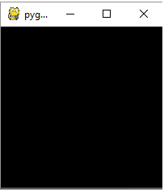

Pygame
======

.. image:: logo_pygame.png
   :align: right
   :alt: Pygame logo

Par Dany Chea [#dc]_

Introduction
------------

Pygame est un module qui offre des outils permettant de créer des jeux.
Le module est lui-même subdivisé en plusieurs sous-modules, ce qui permet de ne pas appeler des modules qui seraient inutiles.
On se contentera ici de présenter les bases de l’utilisation de Pygame, ainsi que le fonctionnement de certains sous-modules.

Liste des sous-modules de Pygame:

+------------------+------------------+-------------------+-------------------+
| `pygame.camera`  | `pygame.cdrom`   | `pygame.cursors`  | `pygame.display`  |
+------------------+------------------+-------------------+-------------------+
| `pygame.draw`    | `pygame.event`   |`pygame.examples`  | `pygame.font`     |
+------------------+------------------+-------------------+-------------------+
| `pygame.freetype`| `pygame.gfxdraw` | `pygame.image`    | `pygame.joystick` |
+------------------+------------------+-------------------+-------------------+
| `pygame.key`     | `pygame.locals`  | `pygame.mask`     | `pygame.math`     |
+------------------+------------------+-------------------+-------------------+
| `pygame.midi`    | `pygame.mixer`   | `pygame.mouse`    | `pygame.pixelcopy`|
+------------------+------------------+-------------------+-------------------+
| `pygame.scrap`   | `pygame.sndarray`| `pygame.sprite`   | `pygame.surfarray`|
+------------------+------------------+-------------------+-------------------+
| `pygame.test`    | `pygame.time`    | `pygame.transform`| `pygame.version`  |
+------------------+------------------+-------------------+-------------------+

Indépendemment du jeu que l’on veut créer, sa réalisation passe nécessairement par 5 étapes:

#. Initialisation de pygame
#. Appel des modules nécessaires
#. L’affichage
#. Boucle infinie
#. Fermeture du programme

l'initialisation:
-----------------
Afin de pouvoir utiliser le module Pygame, il va falloir d'abord l'importer, puis l'initier de la manière suivante:

.. code-block:: python
  >>> import pygame
  >>> pygame.init()

Pygame.locals:
--------------
Pygame contient une quantité de constantes prédéfinies, qui sont chargées dans le namespace pygame, lors de l’importation de celui-ci. Ainsi, lorsque l’on veut utiliser une des constantes, il faut à chaque fois l’appeler en préfixant pygame. suivi du nom de la constante. Afin d’éviter ce préfixe, on peut faire une importation des constantes depuis pygame.locals, comme ci-dessous:
.. code-block:: python
  >>> from pygame.locals import *

Appel des fonctions utiles:
---------------------------
c’est dans cette partie que l’on va initialiser la fenêtre, ainsi que tout les éléments dont on aura besoin.

par exemple, pour afficher une fenêtre:

.. code-block:: python
  >>> fenetre = pygame.display.set_mode((200, 200))

Dans cet exemple, on appelle la fonction :py:meth: set_mode du module display. Ce que l’on obtient en retour, c’est un objet de la classe Surface qui est défini par Pygame.

Résultat:

La boucle infinie:
------------------
Si on se contentait d’exécuter le code ci-dessus, on n’obtiendrait le résultat que pendant une fraction de seconde, car au moment où le code a fini de s’exécuter, il se termine. Il faut donc créer une boucle infinie, de laquelle on peut sortir au moyen d’une action de l’utilisateur.

Exemple de fenêtre simple:
--------------------------
Cet exemple provient de la `documentation pygame <http://www.pygame.org/docs/tut/tom_games2.html#makegames-2>`_

.. literalinclude:: exemple/simpleWindow.py

Exemples:
---------

Son au maintient d'une touche:
^^^^^^^^^^^^^^^^^^^^^^^^^^^^^^
Cet exemple provient du `tutoriel Openclassroom <https://openclassrooms.com/courses/interface-graphique-pygame-pour-python/le-son-5>`_

.. literalinclude:: exemple/mixerEx.py

Dans cet exemple, on a utilisé 2 modules: pygame.mixer, qui est utilisé pour la gestion de sons et pygame.event, qui est utilisé pour la gestion des touches au clavier.

Lors de l’appui, et du maintient de la touche espace, on joue le son qui a été chargé, ou on continue la lecture si le son était sur pause. Lorsque la touche est relâchée, le son est mis sur pause.

Affichage simple d'images:
^^^^^^^^^^^^^^^^^^^^^^^^^^

.. literalinclude:: exemple/loadBG.py

Dans cet exemple, on commence par charger une image. Cette image n’étant pas forcément dans un format supporté par pygame, la fonction pygame.convert est utilisée afin de s’assurer que l’image pourra s’afficher correctement.

.. code-block:: python

  >>> fond = pygame.image.load("background.jpg").convert()

Enfin, on peut afficher l’image en la “collant” sur la fenêtre de base, avec la fonction blit().

.. code-block:: python

  >>> fenetre.blit(fond,(0,0))

Il est a noter que la fonction blit prend en paramètre une Surface, donc l’objet à afficher, ainsi que la position, en sachant que la coordonnée (0,0) est en haut à gauche de la fenêtre.

Conclusion
----------
Pygame est un module très complet, qui nous permet de réaliser des jeux avec une certaine rapidité. Les quelques méthodes présentées ici ne sont qu’une infime partie des méthodes que propose pygame. Afin d’en avoir une liste exhaustive, il est recommandé d’aller consulter la documentation officielle de pygame, disponible à cet endroit: `documentation pygame <https://www.pygame.org/docs/genindex.html>`_

.. [#dc] <dany.chea@he-arc.ch>
