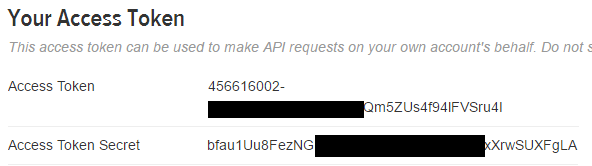

.. _secrets-tutorial:

``secrets``
===========

Par Maël Pedretti [#mp]_

Introduction
------------
Avec une croissance toujours plus rapide et s'intégrant de plus en plus dans notre quotidien, l'informatique moderne requiert une sécurité accrue. Les équipements devenant de plus en plus puissants, il n'est plus suffisant d'utiliser des chaînes pseudo-aléatoires pour sécuriser une transmission. Pour remédier à ce problème, Python s'est aggrandi du module suivant.

:py:mod:`secrets` est un module python utilisé pour générer des chaînes de caractères aléatoires cryptographiquement fortes. Celles-ci sont utilisables pour gérer des données telles que des mots de passe, des authentifications, des jetons de sécurité et autres secrets associés. Ce module n'est disponible que depuis la version 3.6 de python (:pep:`506`).

Utilisations
------------
Ce mode devrait être utilisé de préférence au générateur de nombres pseudo-aléatoires par défaut dans le module :py:mod:`random`, qui est conçu pour la modélisation et la simulation et non pas la sécurité ou la cryptographie.

Nombres aléatoires
******************
Ce module donne accès à la source d'aléatoire la plus sécurisée que votre système d'exploitation fournit.

- Classe :py:class:`secrets.SystemRandom` permet de générer des nombres aléatoires, voir :py:class:`random.SystemRandom` pour plus de détails
- :py:func:`secrets.choice(séquence) <secrets.choice()>` retourne un élément aléatoire à partir d'une *séquence*
- :py:func:`secrets.randbelow(i) <secrets.randbelow()>` retourne un nombre entier aléatoire entre zéro et *i*
- :py:func:`secrets.randbits(j) <secrets.randbits()>` retourne un nombre entier aléatoire composé de *j* bits

Jetons
******
Ce module fournit également des fonctions pour générer des jetons sécurisés, adaptés à des applications telles que des réinitialisations de mots de passe via des URL_ difficiles à deviner, des authentifications via API_ tierces, et d'autres utilisations similaires.

- :py:func:`secrets.token_bytes(k) <secrets.token_bytes()>` retourne une chaine binaire composé de *k* bytes.
- :py:func:`secrets.token_hex(l) <secrets.token_hex()>` retourne une chaine de texte hexadécimale composée de *l* bytes convertis chacun en deux digits hexadécimaux.
- :py:func:`secrets.token_urlsafe(m) <secrets.token_urlsafe()>` retourne une chaine de texte de *m* bytes utilisable dans une URL_. Le texte est encodé en base64_ donc chaque byte est représenté par environ 1.3 charactère.

Si *k*, *l* ou *m* ne sont pas renseignés, un nombre raisonnable sera utilisé par défaut.

Pour résister à une attaque de `force brute`_, les jetons doivent être suffisament longs pour être suffisament aléatoires. Cependant, cette notion de suffisance reste assez vague. Plus les ordinateurs deviennent puissants, plus les jetons devront être longs afin de ralonger le temps nécessaire à une machine pour le découvrir.
D'après la documentation python, des jetons de 32 bytes sont suffisament sécurisés à l'heure actuelle.

Autre
*****

- :py:func:`secrets.compare_digest(a,b) <secrets.compare_digest()>` permet de comparer deux chaînes de texte de manière à réduire le risque d'`attaques temporelles`_. Pour faire court, une attaque temporelle consiste à mesurer le temps requis pour comparer deux chaînes et de ce fait en déduire l'algorithme de comparaison afin de pouvoir subtiliser un mot de passe ou une chaîne de chiffrement.

Exemples
--------

.. literalinclude:: ./examples/password.py

.. code-block:: console

    $ python password.py
    68sZmkdve4

Génération d'un jeton hexadécimal d'une longueur de 16 bytes.

.. code-block:: pycon

    >>> secrets.token_hex(16)
    b'7e5e31e55f5a878980bb230b7e5c7fbe'

Génération d'un jeton d'une longueur de 16 bytes pouvant être utilisé dans une URL

.. code-block:: pycon

    >>> secrets.token_urlsafe(16)
    k84RkJMyMpX6e3qzVXRqcw

On notera la différence de longueur des deux chaînes de 16 bytes. L'encodage utilisé dans la deuxième est à l'origine de cette différence.

Utilisation d'un token
----------------------

L'image ci-dessous démontre l'utilisation de tokens. Pour qu'une application tierce puisse se connecter à l'`API Twitter`_, OAuth_ est utilisé pour lui fournir un accès sécurisé. Dans ce cas, deux jetons sont générés pour pouvoir se connecter. De ce fait, twitter peut vérifier que l'application qui a requis les informations est bien autorisée à le faire et qu'elle respecte le niveau de confidentialité enregistré dans les paramètres.

Dans cet exemple, il n'y pas besoin d'utiliser les fonctions du module secrets. C'est Twitter qui fournit les jetons aux développeurs désireux d'implémenter dans leur application une connexion à l'API. Cependant, si l'on voulait créer un système de connexion personnel utilisant des jetons, il serait tout à fait possible de les générer en utilisant ce module.

Note: Une partie des chaînes de caractère a été cachée car il s'agit de véritables tokens. L'application ne disposant cependant pas de privilèges élevées, aucune information personnelle ne pourra être dérobée même si ces tokens étaient découverts. Ils ne donnent, en effet, l'accès qu'aux données publiques du profil, soit celles que tout un chacun peut consulter.

Conclusion
----------

Le module :py:mod:`secrets` est un module destiné aux utilisateurs avancés ayant des besoins de sécurité supérieurs à la normale. 
Il est simple d'utilisation et offre différents outils permettant la création de mots de passe et jetons sécurisés. Toutefois, ce module n'offre pas la sécurité absolue. Il est nécessaire de connaître le domaine de la sécurité avant d'utiliser les fonctions le composant en se disant que magiquement les données seront protégées. Par exemple, un token aléatoire de 8 bytes ne tiendra pas longtemps face à une attaque de brute-force.

.. [#mp] <mael.pedretti@he-arc.ch>

.. Bibliographie

.. _URL: https://fr.wikipedia.org/wiki/Uniform_Resource_Locator
.. _base64: https://fr.wikipedia.org/wiki/Base64
.. _force brute: https://fr.wikipedia.org/wiki/Attaque_par_force_brute
.. _API: https://fr.wikipedia.org/wiki/Interface_de_programmation
.. _attaques temporelles: https://fr.wikipedia.org/wiki/Attaque_temporelle
.. _API Twitter: https://dev.twitter.com/oauth
.. _OAuth: https://oauth.net
