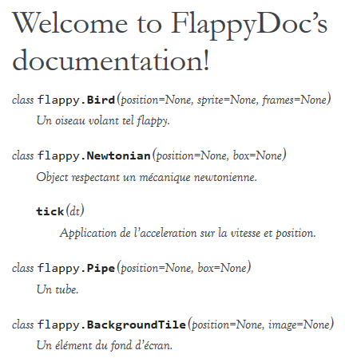

.. _sphinx-tutorial:

``sphinx``
==========

Par Guillaume Noguera [#gn]_

Introduction
------------

Sphinx_ est un générateur de documentation python libre (Licence BSD_).
Sphinx se charge de convertir un ensemble de sources :ref:`reST <sphinx:rst-primer>` vers différents formats (LaTeX, PDF, Epub), en produisant les indices et références internes automatiquement.
Il est également capable de générer une version HTML de la documentation pour une consultation directe et facile.
On peut noter que Sphinx se concentre sur une documentation écrite "à la main", plutôt que sur une documentation auto-générée.

.. et autodoc alors? snif' snif'
   On pourrait dire une documentation séparée du code.

On peut donc considérer grossièrement Sphinx comme un programme qui prends des fichiers reST et les convertis en HTML.

.. alors, très grossièrement.

Pré-réquis
----------

Python 2.7 ou Python 3.4 est impératif au fonctionnement de Sphinx.
La librairie `Pygments <http://pygments.org>`_  peut-être installée si une colorisation syntaxique est requise.

Installation et rapide mise en pratique
---------------------------------------

L'installation de sphinx se fait avec pip via :abbr:`PyPI (Python Packages Index)`.

.. code-block:: console

    $ pip install Sphinx
    $ sphinx-quickstart
    $ ...

Ensuite, il peut être intéressant d'appeler la commande sphinx-quickstart pour générer automatiquement l'arborescence utilisée par Sphinx, ainsi
que les fichiers conf.py et index.rst (configuration par défaut de sphinx-quickstart).

.. Ne serait-ce pas intéressant à montrer?

Structure des fichiers
----------------------

.. highlight:: rest

Le fichier ``index.rst`` placé à l'origine du dossier source, appelé *master document*, agit principalement comme une page d'accueil et contient la table des matières.

.. pas nécessairement index.rst pas nécessairement *la* table des matières.
   Le contenu peut être construit comme un wiki tentaculaire.

Le :ref:`toctree <sphinx:toctree-directive>` (*table of contents tree*) est une fonctionnalité ajoutée à reST par Sphinx et permet de connecter plusieurs fichiers à l'intérieur d'un document::

    .. toctree::
    :maxdepth: 1

    bar.rst
    foo.rst
    sphinx/index.rst
    ...

Il est également possible de changer le titre à afficher en haut de page au lieu du nom de fichier grâce à la notation suivante::

    ..toctree::
    :maxdepth: 1

    A mindblowing theory about narwhals <heapq/whichsurpriseyouforsure.rst>

On peut aussi choisir d'utiliser une liste ordonnée::

    ..toctree::
    :numbered:

Documentation d'un objet
------------------------

La syntaxe pour documenter une fonction est la suivante::

    ..py:function::whatShouldIEat(hangoverLevel, politicalViews[])

       Ignores parameters and returns humus.

    .. py:function:: enumerate(sequence[, start=0])

       Return an iterator that yields tuples of an index and an item of the
       *sequence*. (And so on.)

Le résultat :

    .. py:function:: whatShouldIEat(hangoverLevel, politicalViews[])

       Ignores parameters and always returns humus.

    .. py:function:: enumerate(sequence[, start=0])

       Return an iterator that yields tuples of an index and an item of the
       *sequence*. (And so on.)

Après une fonction documentée, il est possible de créer une référence vers cette dernière::

    La fonction :py:func:`enumerate` peut être utilisée pour ...

Le résultat :

    La fonction :py:func:`enumerate` peut être utilisée pour ...

Il est à noter que la recherche générée par sphinx renvoie également aux définitions de fonctions.
Un référencement systématique me semble être une bonne pratique. La navigation est plus fluide et on évite ainsi des ctrl-f inutiles :)

.. highlight:: none

Les thèmes
----------

.. highlight:: python

Comme pour un content manager tel que Wordpress ou Drupal, Sphinx utilise un système de thème pour déterminer l'aspect visuel du build (html uniquement).

Sphinx vient avec quelques thèmes pré-intallés :

:classic: semblable à la doc officielle python),
:alabaster: le thème actuellement utilisé pour ce livre python),
:sphinxdoc: thème utilisé pour le site officiel de sphinx).

La liste exhaustive est `disponible ici <sphinx:builtin-themes>`_ .

Si l'on désire utiliser un des thèmes pre-installés, il suffit de modifier la ligne suivante dans le fichier conf.py::

    html_theme = "classic"
    html_theme_options = {
        "rightsidebar": "true",
        "relbarbgcolor": "black"
    }

.. highlight:: none

(On peut remarquer que des options sont disponibles, afficher ou non la barre latérale par exemple. Les options sont liées au thème utilisé)

.. Pour faire simple, un thème s'installe via `pip`,

   La manipulation est sensiblement la même pour un thème tiers, en admettant que l'on ait inclus le thème concerné dans un repértoire accessible par sphinx et indiquer son chemin ("html_theme_path = ["."]") dans conf.py. Les thèmes tiers statiques peuvent venir sous deux formes différentes : un dossier composé de sous-fichiers et d'un fichier theme.py, ou un dossier compressé (.zip). La forme que prennent ces derniers ne change néanmoins pas la démarche pour les activer.

Autodoc
-------

Sphinx permet de générer la doc d'un module python ainsi que celle des classes le composant à partir des docstrings - *valides* - contenus dans sa source.
La façon la plus simple est d'inclure l'extension sphinx.ext.autodoc lors de l'utilisation de sphinx-quickstart (desactivé par défaut)::

    ..
    Please indicate if you want to use one of the following Sphinx extensions:
    > autodoc: automatically insert docstrings from modules (y/n) [n]: y
    ..

.. highlight:: python

Sinon, on peut intégrer l'extension dans le fichier conf.py::

    extensions = ['sphinx.ext.autodoc']

..
    beurk, ce problème ne devrait pas se produire, peu intéressant. (Yoan)

    Ensuite, si le module n'est pas inclus dans les variables d'environnement de python, il est possible de rajouter son chemin dans le fichier conf.py.
    Les 3 lignes suivantes sont présentes par défaut dans ce dernier::

        # import os
        # import sys
        # sys.path.insert(0, os.path.abspath('.'))

    Il est donc possible de les décommenter, le chemin étant évidemment à adapter (L'option de mettre un chemin en dur comme en sale étant évidemment disponible à votre désarroi et pour mon grand bonheur)::

        import os
        import sys
        sys.path.insert(0,"C:\\Users\\Guillaume\\Desktop\\FlappyBird\\flappy")

Finalement, la documentation se fait en ajoutant les modules, classes et fonctions désirées dans notre fichier reST.

.. code-block:: rst

    Contents:

    .. toctree::
       :maxdepth: 2

    .. automodule:: Flappy

    .. autoclass:: Bird
        :members:

    .. autoclass:: Pipe
        :members:

.. et avec :members: sur ``Flappy``?

Ainsi, lors de la compilation avec sphinx-build, Sphinx extraira les docstrings des classes concernées, générant ainsi une doc automatique.
Nous nous retrouvons donc avec une chatoyante doc :

Néanmoins, cette méthode comporte un soucis évident : on doit quand même inclure tous les modules et classes manuellement, et ça c'est tout pourri.

.. La seule chose à inclure est le module et ce n'est pas tout pourri, c'est explicite, donc Pythonique.

Heureusement, un utilisateur a créé un script remédiant à ce soucis : il s'agit d'apidoc.

.. ça manque de lien vers la documentation officielle.

APIDoc
~~~~~~

.. highlight:: console

APIDoc est un outil venant avec sphinx. Sa fonction est d'extraire la documentation d'un projet entier, générant ainsi les fichiers \*.rst pour chaque module.
apidoc peut-être invoqué ainsi::

    $ sphinx-apidoc [options] -o <destination> <source> [chemins ...]

Des informations suplémentaires sur son utilisation peuvent être trouvées `à cette adresse <http://sphinx.pocoo.org/man/sphinx-apidoc.html>`_.

Domaines
--------

.. highlight:: rest

Au départ, sphinx a été conçu comme un outil dédié au langage python. Après quelques temps, l'intéret grandissant pour cet outil a poussé le développement de sphinx vers un support multi-langage. Il est donc possible aujourd'hui de documenter des projets C, C++ ou Javascript avec sphinx.

On peut remarquer que dans la définition de la fonction :py:func:`enumerate`, on utilise la notation **.. py:** function: . Ce même préfixe .. py: corresponds justement à un domaine sphinx.
Ces domaines sont en fait une collection de directives reST qui évitent les conflits de noms si le document redigé corresponds à un projet utilisant une multitude de langages, par exemple.

Ainsi, le domaine C est representé par la notation **.. c:**, son équivalent C++ est **.. cpp:**. Javascript se verra malicieusement attribué le tag **.. js:**.

Langage C
~~~~~~~~~

Quelques exemples (:ref:`source <sphinx:domains>`)::

    .. c:function:: PyObject* PyType_GenericAlloc(PyTypeObject *type, Py_ssize_t nitems)
    .. c:member:: PyObject* PyTypeObject.tp_bases

Résultat :

    .. c:function:: PyObject* PyType_GenericAlloc(PyTypeObject *type, Py_ssize_t nitems)

    .. c:member:: PyObject* PyTypeObject.tp_bases

    .. c:type:: Py_ssize_t

        signed int of at least 16 bits (just like ``size_t`` but signed.)

(On appréciera la traduction baguette automatique de sphinx \\[T]/ )

.. Vous pouvez utiliser les *admonitions* pour ce type de remarques.

Langage C++
~~~~~~~~~~~

à noter que les extensions ``:function::``, ``:member::``, etc. sont liées au
langage qu'elles couvrent. Ainsi, pour le C++, nous avons accès à ::

   .. cpp:class::
   .. cpp:member::
   .. cpp:function::
   .. cpp:enum::
   .. cpp:var::
   .. cpp:type::

La liste est longue et le mieux est de vous inviter à consuler la page de référence : :ref:`sphinx:domains`.

JavaScript
~~~~~~~~~~

Exemple JavaScript::

    .. js:function:: $.getJSON(href, callback[, errback])

       :param string href: An URI to the location of the resource.
       :param callback: Gets called with the object.
       :param errback:
           Gets called in case the request fails. And a lot of other
           text so we need multiple lines.
       :throws SomeError: For whatever reason in that case.
       :returns: Something.

Résultat:

    .. js:function:: $.getJSON(href, callback[, errback])

    :param String href: An URI to the location of the resource.
    :param callback: Gets called with the object.
    :param errback:
        Gets called in case the request fails. And a lot of other
        text so we need multiple lines.
    :throws SomeError: For whatever reason in that case.
    :returns: Something.

    .. js:function:: String

        String type

    .. js:Class:: SomeError

        ...

.. Sphinx possède plusieurs domaines, mais est-ce que autodoc, apidoc
   fonctionnent avec eux?

Conclusion
----------

J'aurais pû couvrir bien des notions sur Sphinx et ai essayé d'en couvrir l'essentiel. Il s'agit d'un outil utile qui fera gagner un temps considérable: Après un build html, on peut simplement déposer la documentation sur un serveur. De plus, il est adapté pour un travail en équipe grâce à son aspect "modulaire" (plusieurs indexes séparés, un par librairie dans le cas de notre travail sur ce livre python). Enfin, sa capacité à produire de multiples formats de fichiers à partir du markup reST

J'encourage donc mes éventuels lecteurs à s'y intéresser, quand bien même il faudra se débattre un peu avec son fonctionnement de prime abord. Le retour sur investissement peut valoir le coup.

.. Par rapport à ce que vous connaissez, que vaut Sphinx? Vs javadoc? doxygen?
   ou des alternatives Python, e.g. pydoc (attention les yeux) ? epydoc ?

.. [#gn] <guillaume.noguera@he-arc.ch> ou <guillaume.noguera@gmail.com> pour les trucs moins corpo

.. _Sphinx: http://www.sphinx-doc.org/en/stable/
.. _BSD: https://en.wikipedia.org/wiki/BSD_licenses
