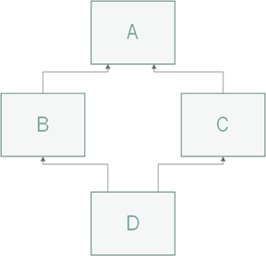

.. _super-tutorial:

``super()``
===========

Par Anthony Fleury [#af]_

Introduction
------------

Python est un langage orienté objet et permet donc de gérer des objets via la
mécanique des classes. Qui dit classes dit héritage et c'est en partie ce qui va
nous intéresser dans ce chapitre, car c'est cette notion nous mène à l'utilisation
du mot-clé :py:func:`super`.

Comme dans d'autres langages de haut niveau, :py:func:`super` nous permet d'interagir avec la
classe parente depuis une spécialisation de celle-ci.

Classes et héritage simple
--------------------------

Voici tout d'abord comment créer une classe basique et la spécialiser sans l'utilisation du mot-clé :py:func:`super`.

.. code-block:: python3
    :linenos:

    class Personne:
        def __init__(self, prenom, nom):
            self.prenom = prenom
            self.nom = nom

        def __str__(self):
            return f"{self.nom} {self.prenom}"

    class Etudiant(Personne):
        def __init__(self, prenom, nom, domaine):
            Personne.__init__(self, prenom, nom)
            self.domaine = domaine

        def __str__(self):
            parent = Personne.__str__(self)
            return f"{parent}, {self.domaine}"

Dans cet exemple, nous créons une première classe `Personne` avec deux attributs (``prenom`` et ``nom``)
ainsi qu'une méthode de conversion en `string` retournant une chaine. La seconde classe nommée `Etudiant`
hérite de `Personne` et dispose d'un attribut supplémentaire ``domaine``. Cette dernière redéfinit la
méthode ``__str__`` afin d'y intégrer son nouvel attribut.

Remarquez l'utilisation directe du nom de la classe parente `Personne` dans les deux méthodes
de la classe `Etudiant`.

Voici maintenant cette même classe en faisant usage de :py:func:`super`.

.. code-block:: python3
    :linenos:

    class Etudiant(Personne):
        def __init__(self, prenom, nom, domaine):
            super().__init__(prenom, nom)
            self.domaine = domaine

        def __str__(self):
            parent = super().__str__()
            return f"{parent}, {self.domaine}"

Dans ce cas, l'appel de la classe parente a tout simplement été remplacé par :py:func:`super`.

L'utilisation de :py:func:`super` a été faite sans arguments, ceci n'est possible que depuis Python3.
Il aurait également été possible d'écrire ``super(Etudiant, self).__init__(prenom, nom)``
mais pourquoir se compliquer la vie.

Héritage multiple
-----------------

Tout comme C++, et contrairement à Java ou C#, Python est capable d'utiliser l'héritage multiple.
Ceci implique forcément des particularités au niveau de l'utilisation de cette mécanique qui
peuvent être gérées à l'aide de :py:func:`super`.

.. code-block:: python3
    :linenos:

    class SousClasse(Classe1, Classe2, Classe3, ...):
        """Classe héritant de plusieurs classes."""

*Diamond Problem*
^^^^^^^^^^^^^^^^^

Le *Diamond Problem* est un terme généralement utilisé pour représenter les ambiguïtés survenant
lorsque deux classes `B` et `C` héritent d'une superclasse `A` et qu'une quatrième classe `D`
hérite à la fois de `B` et `C`.

Si `A` implémente une certaine méthode qui est elle-même redéfinie dans les classes `B` et/ou `C`, 
quelle version de cette méthode sera héritée par la classe `D` ?

Voici un exemple de code illustrant cette fameuse situation :

.. code-block:: python3
    :linenos:

    class A:
        def test(self):
            print("Appel de test depuis A")

    class B(A):
        def test(self):
            print("Appel de test depuis B")

    class C(A):
        def test(self):
            print("Appel de test depuis C")

    class D(B, C):
        pass

    nouveauD = D()
    nouveauD.test()

    # Sortie : Appel de test depuis B

La réponse dépend de l'ordre dans lequel les classes parentes sont spécifiées lors de l'héritage.

**En effet, si B est placée avant C, ce sera alors sa méthode qui est appelée par une instance de D.**

*N.B. Les résultats obtenus peuvent varier selon la version de Python utilisée, mais ils seront tels
qu'indiqués si Python3 est utilisé.*

Utilité de ``super`` lors de l'héritage multiple
^^^^^^^^^^^^^^^^^^^^^^^^^^^^^^^^^^^^^^^^^^^^^^^^

Dans ce premier exemple nous allons retrouver nos quatre classes `A`, `B`, `C` et `D` avec les mêmes
héritages que dans la section précédente (diamond problem). Nous allons observer les différences avec et sans usage
de la méthode :py:func:`super`.

.. code-block:: python3
    :linenos:

    class A:
        def test(self):
            print("Appel de test depuis A")

    class B(A):
        def test(self):
            print("Appel de test depuis B")
            A.test(self)

    class C(A):
        def test(self):
            print("Appel de test depuis C")
            A.test(self)

    class D(B, C):
        def test(self):
            print("Appel de test depuis D")
            B.test(self)
            C.test(self)

    nouveauD = D()
    nouveauD.test()

    # Sortie :
    # Appel de test depuis D
    # Appel de test depuis B
    # Appel de test depuis A
    # Appel de test depuis C
    # Appel de test depuis A

Nous remarquons alors que la méthode test de la classe `A` est appelée deux fois. Une première fois en remontant 
depuis `B` et une seconde fois depuis `C`. Ce comportement n'est pas donc pas idéal, car même si `D` hérite à la fois
de `B` et `C`, la méthode de la classe `A` ne devrait être appelée qu'une seule et unique fois.

.. code-block:: python3
    :linenos:

    class A:
        def test(self):
            print("Appel de test depuis A")

    class B(A):
        def test(self):
            print("Appel de test depuis B")
            super().test()

    class C(A):
        def test(self):
            print("Appel de test depuis C")
            super().test()

    class D(B, C):
        def test(self):
            print("Appel de test depuis D")
            super().test()

    nouveauD = D()
    nouveauD.test()

    # Sortie : 
    # Appel de test depuis D
    # Appel de test depuis B
    # Appel de test depuis C
    # Appel de test depuis A

Cette fois-ci, le comportement observé est celui que nous désirons, mais pourquoi ?

La méthode :py:func:`super` va utiliser l'algorithme :abbr:`MRO (Method Resolution Order)` afin de déterminer l'ordre
d'appel le plus adéquat avec le schéma de classe choisi. Ainsi chaque classe aura une sorte de "chemin" jusqu'à son
parent le plus vieux et c'est ce chemin qui permet d'effectuer les bons appels de méthodes. Il est bon de
constater que l'ordre d'héritage passé à `D` est toujours pris en compte.

Remarquez aussi que nous n'avons également plus besoin de passer ``self`` lors de l'appel de la méthode, car :py:func:`super`
représente directement les objets parents.

Constructeurs avec super et fonctionnement de MRO
^^^^^^^^^^^^^^^^^^^^^^^^^^^^^^^^^^^^^^^^^^^^^^^^^

Cette fois-ci, la méthode implémentée est le constructeur de ces mêmes classes. Comme dans les autres langages, il est nécessaire de faire appel au
constructeur du parent dans celui de l'enfant.

.. code-block:: python3
    :linenos:

    class A:
        def __init__(self):
            print("Constructeur de A")

    class B(A):
        def __init__(self):
            print("Constructeur de B")
            super().__init__()

    class C(A):
        def __init__(self):
            print("Constructeur de C")
            super().__init__()

    class D(B, C):
        def __init__(self):
            print("Constructeur de D")
            super().__init__()

    nouveauD = D()

    # Sortie :
    # Constructeur de D
    # Constructeur de B
    # Constructeur de C
    # Constructeur de A

Le fonctionnement reste équivalent à celui observé auparavant.

Afin de mieux comprendre le fonctionnement :py:func:`super`, il est possible d'afficher le fameux chemin déterminé par MRO : 

.. code-block:: pycon

    >>> D.__mro__
    [<class 'super_init.D'>,
     <class 'super_init.B'>,
     <class 'super_init.C'>,
     <class 'super_init.A'>,
     <class 'object'>]

    >>> B.__mro__
    [<class 'super_init.B'>,
     <class 'super_init.A'>,
     <class 'object'>]

    >>> C.__mro__
    [<class 'super_init.C'>,
     <class 'super_init.A'>,
     <class 'object'>]

    >>> A.__mro__
    [<class 'super_init.A'>,
     <class 'object'>]

Points importants
-----------------

- Afin que :py:func:`super` fonctionne correctement en cas d'héritage multiple, il est nécessaire d'y faire appel dans tous les constructeurs de l'arborescence. Sauf éventuellement pour la classe de base (la plus haute), car héritant obligatoirement de ``object``, cet appel n'aurait pas d'effet.
- L'utilisation d'arguments différents pour les méthodes surchargées peut poser problème. Dans le cas d'une utilisation conjointe avec le mot-clé :py:func:`super`, il faudra utiliser une astuce : les méthodes appelées par :py:func:`super` se transmettent leurs arguments à l'aide de tableaux. Ainsi toutes les versions de la méthode ont la même signature.

Exemple d'utilisation avec des arguments :

.. code-block:: python3
    :linenos:

    class First:
        def __init__(self, *args, **kwargs):
            self.first_arg = kwargs.pop('first_arg')
            super().__init__(*args, **kwargs)

    class Second(First):
        def __init__(self, *args, **kwargs):
            self.second_arg = kwargs.pop('second_arg')
            super().__init__(*args, **kwargs)

    class Third(Second):
        def __init__(self, *args, **kwargs):
            self.third_arg = kwargs.pop('third_arg')
            super().__init__(*args, **kwargs)

    third = Third(first_arg=1, second_arg=2, third_arg=3)

On utilise ``kwargs`` afin de récupérer les arguments aux bons endroits à l'aide de leur nom.

Conclusion
----------

:py:func:`super` est un outil puissant permettant d'accéder aux parents directs lors d'héritage et de
régler différents problèmes dus à l'héritage multiple.

:py:func:`super` reste toutefois complexe à maitriser, car son fonctionnement n'est pas toujours intuitif et évident.

.. car... ?

Les exemples abordés dans cette documentation ne touchent que la partie visible de l'iceberg, car les choses peuvent
vite devenir compliquées lorsqu'on utilise des arguments différents et des schémas de classe complexes.

Pour aller plus loin: `Python's super() considered super! <https://rhettinger.wordpress.com/2011/05/26/super-considered-super/>`_

.. [#af] <anthony.fleury@he-arc.ch>
